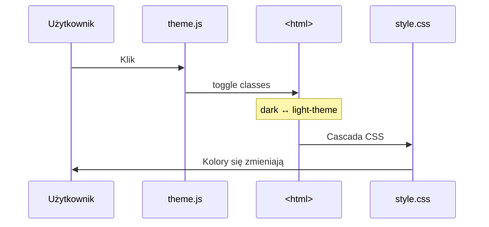

# System Przełączania Motywów DrawLab

## Przegląd

System motywów w projekcie `drawlab-statyczna` wykorzystuje **podejście CSS-first z domyślnym ciemnym motywem**. Przełączanie odbywa się poprzez dodawanie/usuwanie klasy na elemencie `<html>`.

---

## Architektura Systemu

### 1. Klasy na Elemencie HTML

| Stan              | Klasy na `<html>`           | Motyw      |
| ----------------- | --------------------------- | ---------- |
| Ciemny (domyślny) | `scroll-smooth dark`        | Dark Mode  |
| Jasny             | `scroll-smooth light-theme` | Light Mode |

### 2. Przepływ Przełączania



---

## Wzorce Użycia w HTML

### Struktura `<html>` Element

```html
<!-- index.html - domyślnie dark -->
<html lang="pl" class="scroll-smooth dark">
  <!-- kontakt.html - bez klasy dark (JS doda przy ładowaniu) -->
  <html lang="pl" class="scroll-smooth"></html>
</html>
```

> **Uwaga:** JavaScript (`theme.js`) automatycznie ustawia odpowiednie klasy przy ładowaniu strony na podstawie wartości z `localStorage`.

### Konfiguracja Tailwind CDN (v4)

Obie strony zawierają tę samą konfigurację:

```html
<script src="https://cdn.jsdelivr.net/npm/@tailwindcss/browser@4"></script>
<style type="text/tailwindcss">
  @custom-variant dark (&:where(.dark, .dark *));
  @theme {
    --color-fresh-blue: #4ca9df;
    --color-fresh-mint: #a1ffb3;
    --color-bold-coral: #f53844;
    --color-bold-indigo: #42378f;
    --font-display: 'Unbounded', sans-serif;
    --font-sans: 'Inter', system-ui, sans-serif;
  }
</style>
```

### Przykłady Użycia Klas Adaptacyjnych

#### Nawigacja (`nav`)

```html
<nav class="bg-(--bg-color)/90 backdrop-blur-lg border-b border-gray-100 dark:border-white/5"></nav>
```

#### Linki Nawigacyjne

```html
<a href="#" class="nav-link-gradient">Oferta</a>
<!-- Klasa .nav-link-gradient używa var(--gradient-main) -->
```

#### Tekst Drugorzędny

```html
<p class="secondary-text">Opis...</p>
<!-- Klasa .secondary-text używa var(--text-secondary-color) -->
```

#### Przyciski z Gradientem

```html
<a href="#" class="bg-gradient-adaptive text-white px-5 py-2.5 rounded-lg"> Wycena </a>
```

#### Karty (Service Cards)

```html
<div class="service-card p-8 rounded-xl">
  <!-- Używa var(--card-bg), var(--card-border) -->
</div>
```

#### Efekt Szkła (Glassmorphism)

```html
<div class="glass-effect rounded-lg">
  <!-- Używa var(--glass-bg), var(--glass-border) -->
</div>
```

---

### Domyślne Wartości (Dark Mode) - `:root`

```css
:root {
  /* Tła */
  --bg-color: #0d0d0d;
  --card-bg: rgb(23 23 23 / 50%);
  --footer-bg: #1c1c1c;

  /* Tekst */
  --text-color: #e5e7eb;
  --text-secondary-color: #9ca3af;

  /* Gradienty (fiolet → coral) */
  --gradient-main: linear-gradient(135deg, #6366f1 0%, #f53844 100%);
  --accent-color: #6366f1;
  --accent-color-2: #f53844;

  /* Formularze */
  --input-bg: rgb(30 30 30 / 70%);
  --input-border: rgb(255 255 255 / 15%);
}
```

### Override dla Light Mode - `html.light-theme`

```css
html.light-theme {
  /* Tła */
  --bg-color: #f9fafb;
  --card-bg: #fff;
  --footer-bg: #e5e7eb;

  /* Tekst */
  --text-color: #1f2937;
  --text-secondary-color: #4b5563;

  /* Gradienty (niebieski → miętowy) */
  --gradient-main: linear-gradient(135deg, #4ca9df 0%, #2dd4bf 100%);
  --accent-color: #4ca9df;
  --accent-color-2: #2dd4bf;

  /* Formularze */
  --input-bg: #fff;
  --input-border: #d1d5db;
}
```

---

## JavaScript - Moduł theme.js

### Lokalizacja

`js/modules/theme.js`

### Kluczowe Funkcje

```javascript
const setTheme = isLight => {
  if (isLight) {
    document.documentElement.classList.remove('dark');
    document.documentElement.classList.add('light-theme');
  } else {
    document.documentElement.classList.add('dark');
    document.documentElement.classList.remove('light-theme');
  }
};
```

### Persystencja

Motyw jest zapisywany w `localStorage` pod kluczem `theme`:

- `'light'` - jasny motyw
- brak wartości lub inna - ciemny motyw

---

## Używanie Zmiennych w CSS

### ✅ Prawidłowe Podejście

Używaj zmiennych CSS zamiast hardcodowanych kolorów:

```css
/* Tło i tekst */
body {
  background-color: var(--bg-color);
  color: var(--text-color);
}

/* Karty */
.my-card {
  background-color: var(--card-bg);
  border: 1px solid var(--card-border);
}

/* Gradienty */
.my-gradient {
  background-image: var(--gradient-main);
}
```

### ✅ Klasy z Override `html.light-theme`

Gdy potrzebujesz różnych **wartości hardcodowanych** (nie tylko zmiennych):

```css
/* Domyślnie dark mode */
.my-element {
  background: linear-gradient(135deg, #6366f1 0%, #f53844 100%);
}

/* Override dla light mode */
html.light-theme .my-element {
  background: linear-gradient(135deg, #4ca9df 0%, #2dd4bf 100%);
}
```

---

## Dostępne Klasy Adaptacyjne

| Klasa                     | Opis                   | Dark Mode    | Light Mode        |
| ------------------------- | ---------------------- | ------------ | ----------------- |
| `.text-gradient-adaptive` | Gradient tekstowy      | Fiolet→Coral | Niebieski→Miętowy |
| `.bg-gradient-adaptive`   | Gradient tła           | Fiolet→Coral | Niebieski→Miętowy |
| `.shadow-glow-adaptive`   | Cień z poświatą        | Coral glow   | Blue glow         |
| `.gradient-border-button` | Przycisk z grad. ramką | Fiolet→Coral | Niebieski→Miętowy |
| `.glass-effect`           | Efekt glassmorphism    | Ciemne szkło | Jasne szkło       |
| `.secondary-text`         | Tekst drugorzędny      | `#9CA3AF`    | `#4B5563`         |

---

## ⚠️ Czego UNIKAĆ

### ❌ NIE używaj Tailwind `dark:` do przełączania motywów

```html
<!-- ŹLE - nie zadziała z naszym systemem -->
<div class="bg-white dark:bg-black">...</div>
```

**Dlaczego?** Tailwind `dark:` wymaga klasy `dark` na `<html>`, ale nasz system dodaje ją tylko w trybie ciemnym. W trybie jasnym jest `light-theme` (bez `dark`), więc `dark:` style nie zostaną usunięte.

### ✅ Zamiast tego używaj zmiennych CSS

```html
<!-- DOBRZE -->
<div style="background-color: var(--bg-color)">...</div>

<!-- LUB używaj klasy z odpowiednim override w CSS -->
<div class="my-themed-element">...</div>
```

---

## Pełna Lista Zmiennych CSS

### Kolory i Tła

| Zmienna           | Dark                     | Light                    |
| ----------------- | ------------------------ | ------------------------ |
| `--bg-color`      | `#0D0D0D`                | `#F9FAFB`                |
| `--card-bg`       | `rgb(23 23 23 / 50%)`    | `#FFF`                   |
| `--card-bg-hover` | `rgb(23 23 23 / 70%)`    | `#F3F4F6`                |
| `--card-border`   | `rgb(255 255 255 / 10%)` | `rgb(0 0 0 / 10%)`       |
| `--glass-bg`      | `rgb(13 13 13 / 50%)`    | `rgb(249 250 251 / 70%)` |
| `--footer-bg`     | `#1C1C1C`                | `#E5E7EB`                |

### Tekst

| Zmienna                  | Dark      | Light     |
| ------------------------ | --------- | --------- |
| `--text-color`           | `#E5E7EB` | `#1F2937` |
| `--text-secondary-color` | `#9CA3AF` | `#4B5563` |
| `--logo-color`           | `#FFF`    | `#1F2937` |
| `--footer-text`          | `#6B7280` | `#6B7280` |

### Akcenty i Gradienty

| Zmienna            | Dark                | Light               |
| ------------------ | ------------------- | ------------------- |
| `--accent-color`   | `#6366f1` (Indigo)  | `#4CA9DF` (Blue)    |
| `--accent-color-2` | `#F53844` (Coral)   | `#2dd4bf` (Teal)    |
| `--gradient-main`  | `#6366f1 → #F53844` | `#4CA9DF → #2dd4bf` |

### Formularze

| Zmienna                | Dark                     | Light     |
| ---------------------- | ------------------------ | --------- |
| `--input-bg`           | `rgb(30 30 30 / 70%)`    | `#FFF`    |
| `--input-border`       | `rgb(255 255 255 / 15%)` | `#D1D5DB` |
| `--input-focus-border` | `#6366f1`                | `#4CA9DF` |

---

## Checklist dla Nowych Komponentów

- [ ] Używam `bg-(--bg-color)` zamiast `#0D0D0D` / `#F9FAFB`
- [ ] Używam `var(--text-color)` zamiast `white` / `black`
- [ ] Używam `var(--gradient-main)` dla gradientów
- [ ] Jeśli potrzebuję hardcodowanych wartości → dodaję `html.light-theme .my-class` override
- [ ] NIE używam `dark:` z Tailwind do przełączania kolorów
- [ ] Testuję komponent w OBU trybach przed commitowaniem
